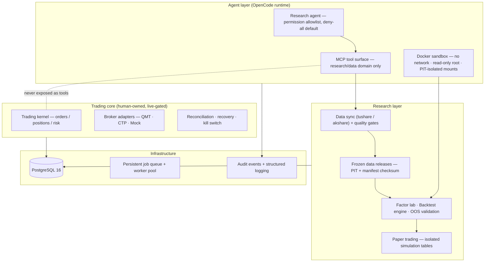

# FinDashboard

[](https://github.com/Caspian-Lin/FinDashboard/actions/workflows/ci.yml)

[简体中文](./README.md) | English

**A quantitative research platform where conclusions stay traceable and trading
permissions stay bounded.**

FinDashboard is a Python + PostgreSQL modular monolith for Chinese A-share research.
Its purpose is not to let an LLM trade directly. Research agents work through a
least-privilege tool surface to ingest data, compute point-in-time factors, backtest,
validate out of sample, and run paper portfolios. Every step freezes its inputs and
retains lineage; order placement, position mutation, and the kill switch are never
exposed to agents. Human engineers remain in control of the trading core.

> [**Explore the interactive demo: how a study is validated, rejected, or promoted**](https://caspian-lin.github.io/FinDashboard/) · [Storyboard and verification notes](./docs/demo/README.md)

> ⚠️ **Disclaimer** — This is a research and engineering project, not a product.
> It is not investment advice, it makes no live trades, and its live-trading path
> (QMT broker verification) is deliberately gated behind manual validation.
> Nothing here is deployed as a public service. Provided as-is, with no warranty.
> Licensed under **AGPL-3.0** (see below).

## Project description

Most "AI + quant" projects let an LLM generate a strategy and hope for the best.
FinDashboard starts from the opposite premise: **an agent is only as trustworthy as
the system it operates in.** So the system enforces, at the infrastructure level:

- **Reproducibility** — research data is published as frozen, checksummed releases;
  every backtest result carries a `result_checksum` that replays deterministically.
- **No lookahead, ever** — point-in-time discipline end to end: factor observations are
  gated by `available_at`, financial data uses `ann_date + 1`, and the code sandbox
  gets *physically isolated* data mounts (a container literally cannot read data
  dated after its decision time).
- **Least privilege for agents** — agents can use research/data MCP tools only.
  Order placement, position mutation, and kill-switch are
  *never registered as tools*. Permission model is deny-all by default with an
  explicit allowlist.
- **Negative results are institutionalized** — the agent maintains a findings registry
  (`docs/research/FINDINGS.md`); refuted hypotheses are recorded with evidence and a
  re-test ban, so future agent sessions don't burn compute re-testing them.

The result so far: an agent that independently researched A-share cross-sectional
momentum across multiple rounds, **falsified it**, and wrote the refutation — with a
full evidence trail — into the registry. That negative result, and the system that
made it trustworthy, is the project's flagship demo.

## Architecture



The dashed edge is the design's core promise: the agent tool surface has **no path**
into the trading core. Trading code was built first (issues #1–#26), battle-tested
against a mock broker, then deliberately frozen while the research platform grew
around it.

## Highlights

**1. Point-in-time data governance.** A pipeline that treats *time of knowledge* as a
first-class column: datasets are ingested with `available_at`/`observed_at`,
published as immutable releases with manifest checksums and schema versioning, and
consumed only through PIT-gated loaders. Cross-dataset consistency checks catch
symbol-set drift between releases before it poisons a backtest.

**2. Agent governance.** Research code submitted by the agent runs in a one-shot
Docker container: `--network none`, read-only root, all capabilities dropped,
non-root, CPU/memory caps, wall-clock kill — and PIT-enforced read-only data mounts.
Promotion is a state machine, not a vibe: `draft → screen → out-of-sample
validation → active`, with every artifact, checksum, and container log archived.
Every tool call lands in an audit table with sanitized inputs.

**3. Agents as sustained researchers.** The agent keeps a research roadmap, a findings
registry with confidence levels and failure conditions, per-session round logs, and
long-term memory — all PR-reviewed documents, shared between human, coding agent, and
research agent. Sessions start by reading prior conclusions; re-testing a refuted
hypothesis requires new evidence and an explicit citation of the old result.

**4. Production-grade engineering.** Unit, integration, and failure-injection tests
cover the critical paths; strict mypy, ruff, and CI defend type and regression
boundaries. The PostgreSQL-backed job queue supports lease recovery,
advisory-lock-serialized claiming, and multi-process workers. Performance changes are
equivalence-locked so throughput never silently changes research semantics.

## Demo

The [interactive demo](https://caspian-lin.github.io/FinDashboard/) uses real local
research data to show a hypothesis moving through frozen releases, factor definition,
OOS validation, ResearchRun lineage, portfolio gates, and isolated simulation, or
ending in the negative-results registry when evidence is insufficient. A pinned,
scroll-driven product window advances through the real English UI; focused GIFs remain
available for README use. OpenCode and simulation footage that is not yet available is
marked as pending rather than staged. A [Chinese translation](https://caspian-lin.github.io/FinDashboard/zh/)
is published alongside the English primary page.

The [storyboard, operator script, and verification record](./docs/demo/README.md) are
also readable directly in the repository.

## Quick start

Prerequisites: Python 3.12+, [uv](https://docs.astral.sh/uv/), Node 18+, PostgreSQL 16 (local or `docker compose`).

```bash
git clone https://github.com/Caspian-Lin/FinDashboard && cd FinDashboard
make install                  # uv sync --all-packages
make web-install              # frontend deps
docker compose up -d          # or use an existing PostgreSQL
cp .env.example .env          # set FINBOARD_DB_URL password
make migrate                  # alembic upgrade head
make test                     # unit tests (CI parity)
make dev                      # API :8000 + web :5173 + background worker
```

Then open `http://localhost:5173`. The trading console connects to a **mock broker**
by default; enabling the research agent (MCP + OpenCode runtime) and the code sandbox
is documented in the operations guide (`docs/research/data-ops.md`).

## Repository layout

```
packages/
  finboard-core/         trading kernel: event bus, orders, positions, strategies
  finboard-broker(-qmt/-ctp)/  broker adapters: QMT (A-share), CTP (futures), Mock
  finboard-risk/         pre-trade checks, kill switch
  finboard-reconcile/    local↔broker reconciliation, restart recovery
  finboard-simulation/   isolated paper-trading accounts (SIM-* tables)
  finboard-scheduler/    trading-day scheduled jobs (never in the research queue)
  finboard-data/         market data sync, PIT frozen releases, quality gates
  finboard-backtest/     replay engine, factor lab, OOS validation
  finboard-research-kit/  sandbox-side SDK for agent-submitted code
  finboard-mcp/          the agent research surface (least privilege, audited)
  finboard-opencode/     agent runtime integration (Docker-isolated web UI)
  finboard-api/          FastAPI REST + WebSocket
  finboard-app/          composition root, CLI, settings
  finboard-persistence/  SQLAlchemy ORM, repositories, migrations
  finboard-shared/       domain models, IDs, exceptions
web/                     React 19 console (trading + research workbench)
docs/research/           the agent's knowledge base: ROADMAP, FINDINGS, round logs
docs/memory/             cross-session engineering memory (39 entries)
docs/dev-guide.md        internal developer guide (full operational detail)
```

## Status

- **Live trading core**: complete and mock-broker-tested (orders, positions,
  recovery, kill switch). Real-broker activation is intentionally gated behind
  QMT verification — see the roadmap in `phase1_doc.md`.
- **Research platform**: operational — data ops, frozen releases, factor lab,
  multi-period rebalancing backtests, validation gates, paper trading.
- **Agent layer**: operational — least-privilege MCP surface, sandboxed code
  execution, promotion chain, audit trail, knowledge persistence.

## License

Released under [GNU AGPL-3.0](./LICENSE). You are free to use, modify, and distribute
this project, but **if you offer it as a network service, you must release your
modified source code under the same license**. This software comes with no warranty;
quantitative research involves real market risk — use at your own discretion.
