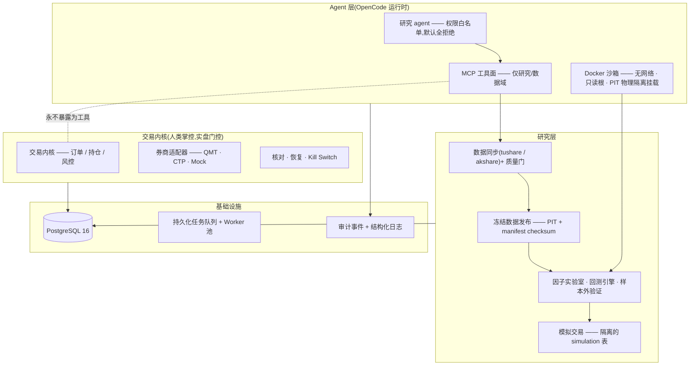

# FinDashboard

[](https://github.com/Caspian-Lin/FinDashboard/actions/workflows/ci.yml)

简体中文 | [English](./README.en.md)

**一个让研究结论可追溯、让交易权限有边界的量化研究平台。**

FinDashboard 面向中国 A 股量化研究,采用 Python + PostgreSQL 模块化单体架构。它的核心不是让 LLM 直接交易,而是让研究 agent 在最小权限工具面内完成数据接入、point-in-time 因子计算、回测、样本外验证和模拟交易;每一步都冻结输入、保留血缘并接受审计。真实下单、持仓修改与 Kill Switch 永远不暴露给 agent,交易内核继续由人类掌控。

> [**查看交互式 Demo:一次研究如何被验证、拒绝或晋级**](https://caspian-lin.github.io/FinDashboard/) · [展示脚本与核验记录](./docs/demo/README.md)

> ⚠️ **免责声明** — 本项目是研究与工程实践项目,不是产品。不构成任何投资建议;不进行任何实盘交易,实盘链路(QMT 券商对接)刻意保持在人工验证门之后;不提供任何公开部署。本项目按「现状」发布,不含任何形式的保证。许可证为 **AGPL-3.0**(见文末)。

## 项目简介

大多数「AI + 量化」项目让 LLM 生成一个策略然后听天由命。FinDashboard 从相反的前提出发:**agent 是否可信,取决于它所运行的系统。** 因此系统在基础设施层面强制保证:

- **可复现** —— 研究数据以冻结、带 checksum 的发布(release)落盘;每个回测结果携带 `result_checksum`,可确定性重放。
- **杜绝前视偏差** —— point-in-time 纪律贯穿全链路:因子观测由 `available_at` 门控,财务数据按 `ann_date + 1` 可用,代码沙箱获得**物理隔离**的数据挂载 —— 容器内根本不存在决策时点之后的数据文件。
- **agent 最小权限** —— agent 只能使用研究/数据域 MCP 工具。下单、改持仓、Kill Switch **永不注册为工具**;权限模型默认全拒绝(deny-all),仅显式放行白名单。
- **负结果制度化** —— agent 维护一份研究结论注册表(`docs/research/FINDINGS.md`),被证伪的假设连同证据一起登记,并触发「重测禁令」,避免后续 agent 会话浪费算力重复验证。

目前的结果:研究 agent 独立完成 A 股截面动量因子的多轮研究后**将其证伪**,并把完整的证伪证据链写入了注册表。这个负结果,以及让它值得信赖的整套系统,就是本项目的招牌 demo。

## 架构



虚线边是这个设计的核心承诺:agent 工具面到交易内核**没有任何通路**。交易代码先行建成(issue #1–#26)并在 mock 券商上充分验证,然后刻意冻结,研究平台在其周边生长。

## 核心亮点

**1. Point-in-Time 数据治理。** 一条把「知识的时点」当作一等公民的管线:数据集以 `available_at` / `observed_at` 摄取,以不可变的发布 + manifest checksum + schema 版本号落盘,只能经 PIT 门控的加载器消费;跨数据集一致性校验在发布阶段就能拦住标的集漂移,不让它污染回测。

**2. Agent 治理。** agent 提交的研究代码在一次性 Docker 容器中执行:无网络、只读根、drop 全部 capabilities、非 root、CPU/内存限额、墙钟超时强杀,以及 PIT 强制的只读数据挂载。晋级是一条状态机而非一句口号:`draft → screen → 样本外验证 → active`,每个 artifact、checksum、容器日志全部归档。每次工具调用落入审计表,入参经脱敏。

**3. agent 作为持续的研究主体。** agent 维护研究路线图、带置信度与失效条件的结论注册表、逐会话轮次日志和长期记忆 —— 全部是走 PR 评审的文档,由人类、编码 agent、研究 agent 三方共享。每个会话从阅读既有结论开始;重测一个已证伪的假设需要新证据并显式引用旧结论。

**4. 生产级工程质量。** 单元、集成与故障注入测试覆盖关键链路,严格 mypy、ruff 与 CI 守住类型和回归边界。PostgreSQL 持久化任务队列支持租约恢复、advisory lock 串行领取与多进程 worker;性能优化以等值测试锁定结果,不用吞吐换研究语义。

## Demo

[交互式 Demo 页面](https://caspian-lin.github.io/FinDashboard/)用真实本地研究数据展示一个假设如何经过冻结发布、因子定义、OOS、ResearchRun、组合门控与隔离模拟,并在证据不足时进入负结果注册表。页面包含总览视频、关键操作 GIF、完整分镜和当前数据状态;未启用的 OpenCode / 模拟盘片段会明确标为待录制,不用摆拍结果填空。

仓库内可直接阅读[展示方案、操作脚本与核验记录](./docs/demo/README.md)。

## 快速开始

前置:Python 3.12+、[uv](https://docs.astral.sh/uv/)、Node 18+、PostgreSQL 16(本机或 `docker compose`)。

```bash
git clone https://github.com/Caspian-Lin/FinDashboard && cd FinDashboard
make install                  # uv sync --all-packages
make web-install              # 前端依赖
docker compose up -d          # 或使用本机已有的 PostgreSQL
cp .env.example .env          # 设置 FINBOARD_DB_URL 的密码
make migrate                  # alembic upgrade head
make test                     # 单元测试(与 CI 一致)
make dev                      # API :8000 + 前端 :5173 + 后台 Worker
```

打开 `http://localhost:5173`。交易控制台默认连接 **mock 券商**;启用研究 agent(MCP + OpenCode 运行时)与代码沙箱的步骤见运维文档(`docs/research/data-ops.md`)。

## 仓库结构

```
packages/
  finboard-core/              交易内核:事件总线、订单、持仓、策略运行器
  finboard-broker(-qmt/-ctp)/ 券商适配器:QMT(A股)、CTP(期货)、Mock
  finboard-risk/              下单前检查、Kill Switch
  finboard-reconcile/         本地↔券商核对、重启恢复
  finboard-simulation/        隔离的模拟盘账户(SIM-* 表)
  finboard-scheduler/         交易日定时任务(不进入研究队列)
  finboard-data/              行情同步、PIT 冻结发布、质量门
  finboard-backtest/          回放引擎、因子实验室、样本外验证
  finboard-research-kit/      沙箱侧 SDK(agent 提交代码用)
  finboard-mcp/               agent 研究工具面(最小权限、可审计)
  finboard-opencode/          agent 运行时集成(Docker 隔离的 Web UI)
  finboard-api/               FastAPI REST + WebSocket
  finboard-app/               组装根、CLI、配置
  finboard-persistence/       SQLAlchemy ORM、Repository、迁移
  finboard-shared/            领域模型、ID、异常
web/                          React 19 控制台(交易 + 研究工作台)
docs/research/                agent 的知识库:ROADMAP、FINDINGS、轮次日志
docs/memory/                  跨会话工程记忆(39 篇)
docs/dev-guide.md             内部开发指南(完整运维细节)
```

## 项目状态

- **实盘交易内核**:已完成并通过 mock 券商验证(订单、持仓、恢复、Kill Switch)。真实券商激活刻意门控在 QMT 验证之后 —— 见 `phase1_doc.md` 路线图。
- **研究平台**:已投运 —— 数据运维、冻结发布、因子实验室、多期再平衡回测、验证门、模拟交易。
- **Agent 层**:已投运 —— 最小权限 MCP 工具面、沙箱代码执行、晋级链、审计轨迹、知识沉淀。

## 许可证

本项目以 [GNU AGPL-3.0](./LICENSE) 发布。这意味着:你可以自由使用、修改、分发本项目,但**若你基于本项目提供网络服务,必须按同一协议公开修改后的完整源码**。本软件不提供任何担保;量化研究涉及真实市场风险,使用本代码产生的任何后果由使用者自行承担。
