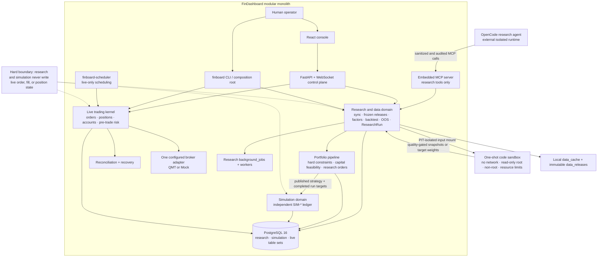

<h1 align="center">FinDashboard</h1>

<p align="center">
  <strong>Auditable quantitative research, bounded by design.</strong><br>
  A modular Python and PostgreSQL platform for point-in-time A-share research, controlled agent workflows, isolated simulation, and a human-owned trading core.
</p>

<p align="center">
  <a href="./README.zh-CN.md">简体中文</a> ·
  <a href="https://caspian-lin.github.io/FinDashboard/">Interactive demo</a> ·
  <a href="./docs/demo/README.md">Demo notes</a>
</p>

<p align="center">
  <a href="https://github.com/Caspian-Lin/FinDashboard/actions/workflows/ci.yml"></a>
  <a href="https://github.com/Caspian-Lin/FinDashboard/actions/workflows/pages.yml"></a>
  <a href="./LICENSE"></a>
</p>

> [!WARNING]
> FinDashboard is a research and engineering project, not investment advice or a hosted trading service. Live broker activation remains behind manual validation gates. The software is provided as-is, without warranty.

## What FinDashboard is

FinDashboard is built around one premise: **a research agent is only as trustworthy as the system in which it operates.** It does not let an LLM connect to a broker or mutate positions. Instead, it gives external agents a least-privilege research surface while the platform enforces reproducibility, point-in-time discipline, validation gates, and domain isolation.

- **Frozen evidence:** data releases, strategy specifications, manifests, fees, constraints, artifacts, and result checksums remain traceable.
- **Point-in-time by construction:** every decision input obeys `available_at <= decision_at`; code sandboxes receive physically isolated data mounts.
- **Promotion through evidence:** research moves through screen, backtest, OOS validation, simulation, shadow, and small-capital gates.
- **Negative results persist:** refuted hypotheses are registered with evidence so later sessions cannot silently repeat them.
- **Live authority stays human:** orders, position mutation, credentials, broker connectivity, and the Kill Switch are never exposed as agent tools.

## See the evidence loop

The [interactive demo](https://caspian-lin.github.io/FinDashboard/) follows one hypothesis through frozen data, factor definition, OOS validation, ResearchRun lineage, portfolio constraints, isolated simulation, and job audit. The product window stays pinned while the evidence advances with the page.

The media is captured from the real English UI and local research database. Empty simulation state and unavailable agent footage remain explicit rather than being replaced with fabricated performance.

> [Open the demo](https://caspian-lin.github.io/FinDashboard/) · [Read the storyboard and verification record](./docs/demo/README.md)

## Architecture

FinDashboard is a **modular monolith**. Research, simulation, and live trading share one deployable application and PostgreSQL instance, but use separate state models, queues, and authority boundaries.



The two execution lanes are intentionally different:

- `background_jobs` serves research, data, backtest, and performance work.
- `finboard-scheduler` serves the trading kernel and is never exposed through MCP.

The MCP registry has no order placement, cancellation, position mutation, broker connection, credential probing, or Kill Switch tools.

## System boundaries

| Domain | What it owns | Non-negotiable boundary |
|---|---|---|
| Research | datasets, factor snapshots, experiments, backtests, `RR-*`, artifacts | Never writes live `orders`, `fills`, `positions`, or live audit semantics |
| Simulation | `SIM-*` sessions, paper orders, fills, positions, cash | Accepts published strategies and completed ResearchRun targets only; no broker connection or auto-promotion |
| Live trading | order lifecycle, positions, accounts, risk, reconciliation, recovery | Human-controlled; one account, one configured broker, one market during the current phase |
| Agent runtime | research planning, controlled MCP calls, versioned code submission | Deny-all by default; submitted code executes only in a one-shot sandbox |

## Core capabilities

### Research and data

- Dataset sync and immutable releases with quality gates, manifests, and checksums
- Point-in-time factor assembly, user-factor series, and reproducible feature snapshots
- Single-shot and multi-period backtests with explicit decision schedules
- Pre-registered OOS validation and one-way final-test reveal
- Unified ResearchRun lineage, artifacts, replay, reports, and durable job recovery

### Portfolio and simulation

- Long-only portfolio pipeline with concentration and risk-contribution constraints
- Discrete-lot solving, fee modeling, and three-tier capital feasibility
- Independent simulation ledger with paper orders, fills, positions, cash, and audit history

### Controlled agent research

- Audited MCP tools for research, data, factors, strategies, runs, jobs, reports, and memory
- Versioned Python submission with import and filesystem restrictions
- One-shot Docker execution with no network, read-only root, dropped capabilities, and resource limits
- Promotion lifecycle from draft and screen through OOS validation to active artifacts

## Quick start

Prerequisites: Python 3.12+, [uv](https://docs.astral.sh/uv/), Node.js 18+, and PostgreSQL 16.

```bash
git clone https://github.com/Caspian-Lin/FinDashboard
cd FinDashboard
make install
make web-install
docker compose up -d
cp .env.example .env
make migrate
make test
make dev
```

Open `http://localhost:5173`. The trading console uses a **Mock broker** by default. Configure database credentials in `.env`; do not enable QMT until the machine-verification gates in the project roadmap are complete.

Useful checks:

```bash
uv run pytest tests/unit/ -v
uv run pytest tests/integration/ -v
uv run ruff check packages/ tests/
uv run mypy .
```

## Repository map

```text
packages/
  finboard-app/           composition root, CLI, settings, embedded runtime startup
  finboard-api/           FastAPI REST and WebSocket control plane
  finboard-data/          data sync, PIT releases, manifests, quality gates
  finboard-backtest/      factor research, replay, validation, ResearchRun execution
  finboard-simulation/    independent paper-trading ledger
  finboard-mcp/           least-privilege, audited research tool surface
  finboard-opencode/      isolated OpenCode runtime control plane
  finboard-research-kit/  SDK available inside submitted-code sandboxes
  finboard-core/          trading kernel, event bus, orders, positions, accounts
  finboard-risk/          pre-trade checks and Kill Switch
  finboard-reconcile/     broker reconciliation and restart recovery
  finboard-scheduler/     live-kernel scheduled tasks
  finboard-broker*/       broker abstractions plus Mock, QMT, and CTP packages
  finboard-persistence/   SQLAlchemy models, repositories, migrations
  finboard-shared/        domain models, identifiers, errors, runtime utilities
web/                      React console for research and human trading control
docs/research/            canonical agent roadmap, findings, and research rounds
docs/memory/              cross-session engineering decisions and operational traps
docs/demo/                GitHub Pages demo, media, and recording plan
```

## Project status

- **Research platform:** operational for data publishing, factors, backtests, OOS validation, ResearchRuns, portfolio construction, simulation, and reporting.
- **Agent layer:** operational for least-privilege MCP research, sandboxed code execution, promotion gates, audits, and durable research memory.
- **Live trading core:** implemented and Mock-broker tested. Real QMT activation remains paused pending machine verification, instrument metadata completion, and continuous-run validation.

The current phase prioritizes research data releases, factor experiments, ResearchRuns, portfolio constraints, simulation, and performance pipelines. Advanced execution algorithms and multi-account routing are intentionally out of scope.

## Documentation

- [Development guide](./docs/dev-guide.md)
- [Research data operations](./docs/research/data-ops.md)
- [Research roadmap and findings](./docs/research/)
- [Demo plan and verification](./docs/demo/README.md)
- [Production-grade system plan](./phase1_doc.md)

## License

Released under the [GNU Affero General Public License v3.0](./LICENSE). If you offer a modified version as a network service, you must make the corresponding source available under the same license.
