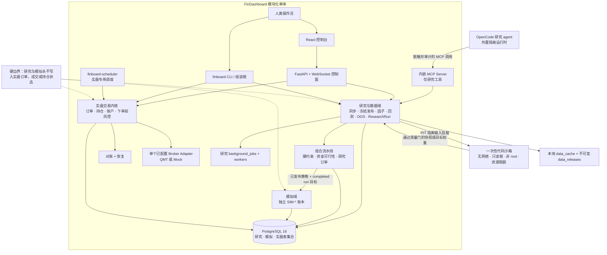

<h1 align="center">FinDashboard</h1>

<p align="center">
  <strong>让量化研究可审计，让交易权限有边界。</strong><br>
  面向中国 A 股的 Python + PostgreSQL 模块化单体平台，覆盖时点一致研究、受控 Agent、隔离模拟盘与人类掌控的交易内核。
</p>

<p align="center">
  <a href="./README.md">English</a> ·
  <a href="https://caspian-lin.github.io/FinDashboard/zh/">交互式 Demo</a> ·
  <a href="./docs/demo/README.md">展示方案</a>
</p>

<p align="center">
  <a href="https://github.com/Caspian-Lin/FinDashboard/actions/workflows/ci.yml"></a>
  <a href="https://github.com/Caspian-Lin/FinDashboard/actions/workflows/pages.yml"></a>
  <a href="./LICENSE"></a>
</p>

> [!WARNING]
> FinDashboard 是研究与工程实践项目，不构成投资建议，也不是公开托管的交易服务。真实券商激活仍受人工验证门约束。本软件按现状提供，不作任何担保。

## FinDashboard 是什么

FinDashboard 建立在一个前提上：**研究 agent 是否可信，取决于它所运行的系统。** 系统不允许 LLM 连接券商或修改持仓，而是给外置 agent 一组最小权限的研究工具，同时在平台层强制可复现、point-in-time、验证门与领域隔离。

- **证据冻结：** 数据发布、策略规格、manifest、费用、约束、产物和结果 checksum 全部可追溯。
- **时点一致：** 每项决策输入满足 `available_at <= decision_at`；代码沙箱只挂载决策时点可见的数据。
- **以证据晋级：** 研究依次经过 screen、回测、OOS、模拟、影子和小资金门控。
- **负结果持久化：** 被证伪的假设连同证据进入结论注册表，后续会话不能无条件重复测试。
- **实盘权限归人：** 下单、改持仓、凭证、券商连接与 Kill Switch 永不暴露为 agent 工具。

## 查看证据闭环

[交互式 Demo](https://caspian-lin.github.io/FinDashboard/zh/)用一个研究假设串起冻结数据、因子定义、OOS 验证、ResearchRun 血缘、组合约束、隔离模拟与任务审计。页面向下滚动时，产品窗口保持定格并随步骤推进。

全部画面来自真实英文 UI 和本地研究库。模拟盘没有合格数据时保留真实空状态，未启用的 Agent 片段也不会用虚构业绩补齐。

> [打开中文 Demo](https://caspian-lin.github.io/FinDashboard/zh/) · [阅读分镜与核验记录](./docs/demo/README.md)

## 架构

FinDashboard 是**模块化单体**。研究、模拟和实盘共享一个可部署应用与 PostgreSQL 实例，但使用独立的状态模型、任务通道和权限边界。



两条执行通道刻意分离：

- `background_jobs` 只服务研究、数据、回测与性能任务。
- `finboard-scheduler` 只服务交易内核，且永不通过 MCP 暴露。

MCP 注册表不存在下单、撤单、改持仓、连接券商、探测凭证或操作 Kill Switch 的工具。

## 系统边界

| 领域 | 持有的状态 | 不可放松的边界 |
|---|---|---|
| 研究 | 数据集、因子快照、实验、回测、`RR-*`、产物 | 永不写实盘 `orders`、`fills`、`positions` 或实盘审计语义 |
| 模拟 | `SIM-*` 会话、纸面订单、成交、持仓、资金 | 只接受已发布策略与 completed ResearchRun 目标；不连接券商、不自动晋级 |
| 实盘 | 订单生命周期、持仓、账户、风控、对账、恢复 | 人类掌控；当前阶段单账户、单个已配置券商、单市场 |
| Agent 运行时 | 研究规划、受控 MCP 调用、版本化代码提交 | 默认全拒绝；提交代码只能在一次性沙箱中执行 |

## 核心能力

### 研究与数据

- 数据同步与不可变发布，包含质量门、manifest 和 checksum
- Point-in-time 因子装配、用户因子序列与可复现特征快照
- 显式决策日程的 single-shot / multi-period 回测
- 预注册 OOS 验证和一次性最终测试揭盲
- 统一 ResearchRun 血缘、产物、重放、报告与持久任务恢复

### 组合与模拟

- Long-only 组合流水线，执行集中度与风险贡献硬约束
- 离散手数求解、费用模型与三档资金可行性
- 独立模拟账本，记录纸面订单、成交、持仓、资金与审计历史

### 受控 Agent 研究

- 覆盖研究、数据、因子、策略、运行、任务、报告和记忆的审计型 MCP 工具
- 带 import 与文件系统限制的版本化 Python 提交
- 无网络、只读根、drop capabilities、非 root、资源受限的一次性 Docker 执行
- 从 draft、screen、OOS 到 active 产物的晋级生命周期

## 快速开始

前置条件：Python 3.12+、[uv](https://docs.astral.sh/uv/)、Node.js 18+、PostgreSQL 16。

```bash
git clone https://github.com/Caspian-Lin/FinDashboard
cd FinDashboard
make install
make web-install
docker compose up -d
cp .env.example .env
make migrate
make test
make dev
```

打开 `http://localhost:5173`。交易控制台默认使用 **Mock broker**。数据库凭证写入 `.env`；在项目路线图中的真机验证门完成前，不要启用 QMT。

常用检查：

```bash
uv run pytest tests/unit/ -v
uv run pytest tests/integration/ -v
uv run ruff check packages/ tests/
uv run mypy .
```

## 仓库地图

```text
packages/
  finboard-app/           组装根、CLI、配置、内嵌运行时启动
  finboard-api/           FastAPI REST 与 WebSocket 控制面
  finboard-data/          数据同步、PIT 发布、manifest、质量门
  finboard-backtest/      因子研究、回放、验证、ResearchRun 执行
  finboard-simulation/    独立纸面交易账本
  finboard-mcp/           最小权限、可审计的研究工具面
  finboard-opencode/      隔离 OpenCode 运行时控制面
  finboard-research-kit/  提交代码沙箱内可用的 SDK
  finboard-core/          交易内核、事件总线、订单、持仓、账户
  finboard-risk/          下单前检查与 Kill Switch
  finboard-reconcile/     券商对账与重启恢复
  finboard-scheduler/     实盘内核定时任务
  finboard-broker*/       Broker 抽象以及 Mock、QMT、CTP 包
  finboard-persistence/   SQLAlchemy 模型、Repository、迁移
  finboard-shared/        领域模型、标识符、异常、运行时工具
web/                      研究与人工交易控制 React 控制台
docs/research/            Agent 路线图、结论与研究轮次的唯一事实来源
docs/memory/              跨会话工程决策与运行坑位
docs/demo/                GitHub Pages Demo、媒体与录制规划
```

## 项目状态

- **研究平台：** 数据发布、因子、回测、OOS、ResearchRun、组合、模拟与报告已可运行。
- **Agent 层：** 最小权限 MCP、沙箱代码执行、晋级门、审计与持久研究记忆已可运行。
- **实盘交易内核：** 已实现并通过 Mock broker 验证。真实 QMT 激活仍等待真机验证、标的元数据完成和连续运行验证。

当前主线是研究数据发布、因子实验、ResearchRun、组合约束、模拟与性能流水线。高级执行算法和多账户路由仍明确不在当前范围内。

## 文档

- [开发指南](./docs/dev-guide.md)
- [研究数据运维](./docs/research/data-ops.md)
- [研究路线图与结论](./docs/research/)
- [Demo 方案与核验](./docs/demo/README.md)
- [生产级系统计划](./phase1_doc.md)

## 许可证

本项目采用 [GNU Affero General Public License v3.0](./LICENSE)。如果你基于修改后的版本提供网络服务，必须按同一许可证公开相应源码。
