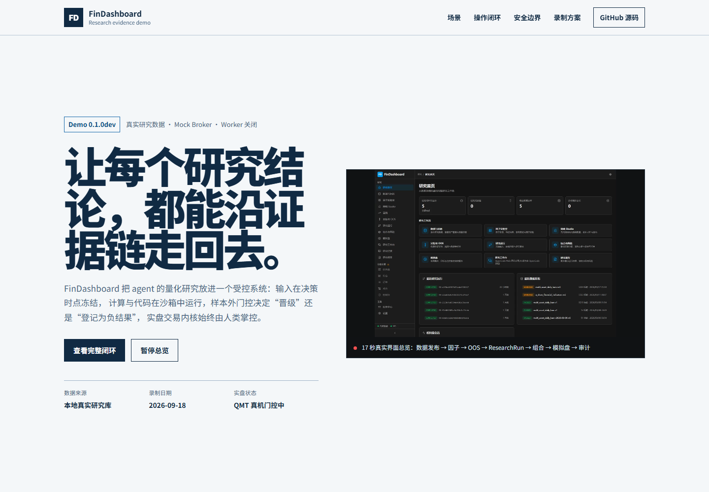

# FinDashboard Demo 展示方案与核验记录

- 英文主页面：<https://caspian-lin.github.io/FinDashboard/>
- 中文翻译：<https://caspian-lin.github.io/FinDashboard/zh/>

本 Demo 的主角不是某条“高收益曲线”，而是一个研究结论如何被系统约束、验证、追溯，并在证据不足时被安全地阻止晋级。英文主页面使用滚动驱动的定格产品窗口展示完整闭环，中文页面提供对应翻译；产品画面统一使用英文 UI。页面和媒体均基于 2026-09-18 本地开发环境中的真实研究数据录制；录制时使用 mock broker、关闭后台 Worker，不连接真实券商，不创建订单，也不修改研究或模拟数据。

## 典型场景

研究负责人提出问题：**A 股截面动量是否存在稳定、成本后的样本外超额？**

Agent 和平台需要给出可复核的回答，而不是只给一张收益图：

1. 选择带时间范围、质量报告和 checksum 的冻结数据发布；
2. 检查因子经济含义、计算口径、方向和数据来源；
3. 预注册 IS / validation / OOS 时间窗口、阈值和试验预算；
4. 执行验证实验，并以 `oos_outcome` 而不是流程状态判断结论；
5. 检查 ResearchRun 的策略版本、manifest、费用、约束、产物和结果 checksum；
6. 证据支持时进入组合约束、三档资金可行性和隔离模拟盘；证据不足时写入 `docs/research/FINDINGS.md`，保留失败 run，并触发重测禁令。

当前结论注册表中的 F-1 已将“A 股截面价格动量选股样本外无稳定超额”登记为多轮独立证伪。Demo 把这个负结果当作正确闭环，而不是为了展示效果把它包装成可交易策略。

## 展示操作与媒体规划

| 阶段 | 操作 | 页面展示 | 系统证据 | 媒体 |
|---|---|---|---|---|
| 总览 | 向下滚动推进七个操作 | 数据、因子、OOS、运行、组合、模拟、任务 | 当前真实页面状态 | 定格滚动窗口，已实现 |
| 数据冻结 | 打开「数据与标的 → 每日指标」 | 已发布版本、覆盖率、质量 warning | release ID、日期范围、复权口径 | 总览片段 + `data-release.png`，已核验 |
| 因子定义 | 打开「因子实验室」 | 经济含义、公式口径、来源、方向 | 因子目录与版本 | 总览片段 + `factor-lab.png`，已核验 |
| 样本外验证 | 从实验列表选中已揭盲实验 | 假设、时间窗口、试验数、结论 | experiment ID、`oos_outcome` | 英文截图 + `assets/oos-validation.gif` |
| 运行血缘 | 从运行列表选中 completed run | 冻结输入、策略版本、运行状态 | RR-*、manifest、result checksum | 英文截图 + `assets/research-run.gif` |
| 组合与模拟 | 选择合格 run，计算组合并创建模拟会话 | 风险贡献、离散订单、账本、权益 | 硬约束结果、SIM-*、simulation_* | 当前只有入口与空状态；等待真实合格数据后补录 |
| Agent 操作 | 在 OpenCode 中提交研究任务 | 工具调用、job、报告引用 | MCP 审计事件、job ID | 本次隔离 worktree 未启用运行时；后续单独补录 |

## 当前页面内容核验

本次使用独立 worktree `feat/demo-showcase-491` 启动前端与 API，端口为 API `8004`、Web `5176`。为了复用已有研究产物，服务连接主开发数据库；`finboard dev` 使用 `--no-worker`，录制过程只浏览现有数据，没有消费队列任务或提交写操作。

核验到的状态：

- 研究首页、数据发布、因子目录、OOS 实验、ResearchRun、任务中心均有真实可展示记录；
- 组合与风险页面已提供信号、约束与资金可行性入口，但本次未选择 run 执行计算；
- 模拟盘没有账户与会话，研究报告没有可选模拟数据，页面按真实空状态展示；
- API health 明确返回 `broker_kind=mock`；QMT 真机验证和连续运行仍受 #22 / #24 / #26 门控；
- OpenCode 在 worktree 配置中关闭，本次没有启动容器或伪造 agent 会话。

## 录制与复核约束

- 截图尺寸、语言、主题、悬浮层清理、固定文件名与 GIF 编码统一遵循 [`docs/memory/demo-capture-spec.md`](../memory/demo-capture-spec.md)；
- 使用无头 Chrome / DevTools Protocol 和 ffmpeg 录制英文产品画面，不使用 Computer Use；
- 不在媒体中展示凭证、token、数据库连接串或未脱敏 prompt；
- 不用直接写数据库、手工改状态或营销 mock 图补齐缺失结果；
- 页面使用原产品深色 token、8px 面板圆角、6px 控件圆角、弱边框和无阴影；未引入 Tailwind CSS 或额外构建步骤；
- 定格滚动使用原生 `position: sticky`、passive scroll + `requestAnimationFrame` 和 CSS opacity/transform 过渡，GitHub Pages 静态托管即可运行；
- 文本选择色使用产品蓝的半透明变体，不使用浏览器默认选择色；
- 每段媒体只展示一个动作，截图与 GIF 保留页面中的 run ID、状态和 warning，方便回查；
- 模拟盘与 Agent 两段只有在真实数据和运行时可用后补录，替换媒体不改变页面叙事；
- 发布前在桌面和移动宽度检查布局、键盘焦点、替代文本与 `prefers-reduced-motion`。

## 发布顺序

1. 功能分支 PR 合入 `dev`（唯一需要用户确认的合并点）；
2. 将确认后的 `dev` 发布内容合入 `main`；
3. GitHub Pages 工作流从 `main` 的 `docs/demo/` 部署静态页面；
4. 在 `main` 创建 tag `v0.1.0dev` 和 GitHub prerelease，Release Notes 明确开发版边界；
5. 核对 README Demo 链接、Pages URL、Release 附件与 CI 状态。

发布不授权真实交易，不改变交易内核、Broker、持仓、风控或 Kill Switch 逻辑。
